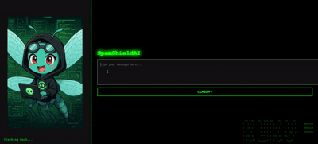

# SpamShieldAI

SpamShieldAI is a web-based application powered by artificial intelligence to detect and block spam across multiple communication channels. By combining natural language processing (NLP), machine learning classifiers, and real-time analysis, the system provides adaptive and robust protection against unsolicited or malicious content.

## Features

- **Spam Detection**: Accurately classifies messages as spam or not spam.
- **Natural Language Processing**: Advanced text preprocessing, including tokenization, stopword removal, and stemming.
- **User-Friendly Web Interface**: Intuitive interface for real-time message analysis.
- **Trained Model**: Optimized machine learning model using Naive Bayes.
- **Extensibility**: Ready to integrate with other systems or communication platforms.

## Demo

Below is a demonstration of SpamShieldAI in action:



## Prerequisites

- Python 3.8 or higher
- Flask
- scikit-learn
- nltk
- joblib

## Installation

1. Clone this repository:
   ```bash
   git clone https://github.com/your-username/SpamShieldAI.git
   cd SpamShieldAI
   ```

2. Install the dependencies:
```
pip install -r requirements.txt
```
3. Download the necessary NLTK data:
```
import nltk
nltk.download('punkt')
nltk.download('stopwords')
```
## Usage

1. Start the Flask application:
```
python app/app.py
```
2. Open your browser and navigate to http://127.0.0.1:5000.
3. Enter a message in the text box and click "Classify" to determine if it is spam or not.

## Project Structure
```
SpamShieldAI/
├── [README.md](http://_vscodecontentref_/1)
├── app/
│   ├── app.py                # Main Flask application code
│   ├── templates/
│   │   └── index.html        # User interface
│   ├── static/               # Static resources
│   ├── notebooks/
│   │   └── spam_classification.ipynb  # Model training notebook
│   ├── datasets/             # Folder for storing datasets
│   └── libs/                 # Additional libraries
└── requirements.txt          # Project dependencies
```
## Contributing

Contributions are welcome! If you'd like to improve this project, please open an issue or submit a pull request.

## Credits

Developed by Christian Urcuqui.
